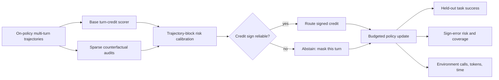

# START HERE — CARe: Risk-Controlled Turn Credit for Agentic RL

Protocol ID: `CARE-P3-PILOT-v0.2`
Decision date: `2026-07-30`
Target: main-conference method paper
Current authorization: completed CPU requalification only
GPU training status: `BLOCKED_PENDING_EXPLICIT_USER_AUTHORIZATION`

## Owner goal

Develop and falsify a method for reliable turn-level credit assignment in
multi-turn language-agent reinforcement learning. The working method, **CARe**,
routes policy-gradient credit only to turns whose credit sign is sufficiently
reliable, abstains on uncertain turns, and respects a declared supervision-token
budget.

The paper is not about the existence of AReno's three static
`trainable_turns` modes. Those modes are engineering primitives and diagnostic
controls. The proposed scientific contribution is risk-controlled selective
credit routing under noisy turn-credit estimates.

## Binding scope separation

- The old trajectory-censoring coding instrument ended at
  `KILL_CURRENT_CODING_INSTRUMENT`. It must not be retried, scaled, or used as
  evidence for this route.
- The issue #199 Tic-Tac-Toe three-arm harness remains an integration smoke
  test. On its canonical trajectories, `last_assistant` and `final_answer`
  select the same span and are not independent scientific treatments.
- Existing token counts measure supervision density. With the current dense
  implementation they do **not** establish lower GPU FLOPs or wall-clock cost.
- Tool-call arguments are model-generated actions in the current examples.
  They must not be described as environment-determined tokens.

## Current gate

`P3-v0.2-CPU-FREEZE-PASSED-GPU-BLOCKED`

Read in order:

1. `p3/gpu_gate_decision_20260730.md`
2. `p3_v02/LITERATURE_REFRESH.md`
3. `p3_v02/POSTMORTEM_AND_PROTOCOL.md`
4. `p3_v02/CPU_GATE_DECISION.md`
5. `RESEARCH_PLAN.md`
6. `HYPOTHESES_AND_GATES.md`

Then inspect the worktree and the completed P0/P1/P2/P3 CPU decisions. The
frozen P3 runner, task, router, asset manifest, artifact collector, commands,
resource cap, and GO/KILL rule exist. Do not provision a host, download model
weights, train, serve, or use a paid API without a new explicit authorization.

For an AutoDL instance, read `p3/AUTODL_HANDOFF.md` before remote access.

## Working method in one figure

## Stage state

| Stage | State | Opening condition |
|---|---|---|
| P0 full-text novelty audit | `PASS_NOVELTY_CONDITIONAL` | Completed |
| P1 formalization and CPU oracle | `PASS_THEORY_ORACLE_CONDITIONAL_TO_P2` | Completed |
| P2 AReno instrument qualification | `PASS_P2_INSTRUMENT_TO_P3_DESIGN` | Completed |
| P3-v0.1 bounded GPU pilot | `KILL_P3_EXECUTABILITY` | Terminal first-run loader crash; evidence preserved |
| P3-v0.2 CPU requalification | `PASS_P3_V02_CPU_FREEZE_TO_GPU_AUTHORIZATION_REQUEST` | Completed; GPU not run |
| P3-v0.2 bounded GPU pilot | `BLOCKED_PENDING_EXPLICIT_USER_AUTHORIZATION` | New authorization for the frozen commit and ceilings |
| P4 variance/resource freeze | `UNOPENED` | P3-v0.2 GPU qualification has not passed |
| P5 confirmatory multi-seed study | `UNOPENED` | Frozen manifest plus new explicit authorization |
| P6 transfer/robustness study | `UNOPENED` | P5 primary gate passes |
| P7 paper claim gate | `UNOPENED` | All admissible evidence archived |

## First executable work

There is no further executable stage under `CARE-P3-PILOT-v0.1`. P3-v0.2
preserves its evidence and scientific design while adding only a production
loader fix and CPU regression. After the reviewed source commit is frozen, the
next legal action is a read-only remote preflight followed by a new explicit
GPU authorization. P4–P7 remain unopened.

## Evidence and artifact roots

- Engineering harness:
  `examples/agentic/trainable_turns_ablation/`
- Per-step metric path:
  `areno/api/metrics.py`
- Proposed research artifacts:
  `research/care_turn_credit_mainconf/`
- P3-v0.2 protocol and CPU decision:
  `research/care_turn_credit_mainconf/p3_v02/`

## Stop rules

- Stop at the first terminal `KILL`, `INVALID`, or `BLOCKED` decision.
- Do not repair a consumed confirmatory run or selectively rerun failed seeds.
- Do not use a pilot reward curve as efficacy evidence.
- Do not rent or start a GPU until the user approves the exact frozen command,
  model, expected GPU-hours, and spending ceiling.
