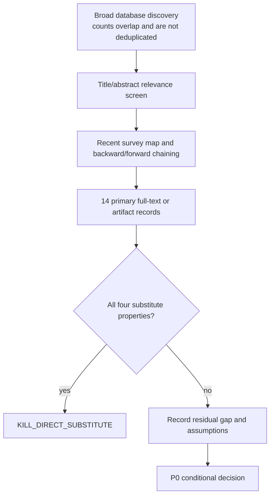

# P0 Search and Screening Log

Protocol: `CARE-P0-v0.1`
Search date: `2026-07-29`
Decision scope: direct-substitute audit for risk-controlled selective turn credit
Training performed: none

## Frozen review question

Does a public method already combine all of the following for multi-turn
language-agent training under assumptions no stronger than CARe's proposed
setting?

1. signed turn- or segment-level credit;
2. finite-sample control of wrong-sign update risk;
3. explicit abstention from uncertain turn updates; and
4. routing under a declared trainable-token or supervision-token budget.

The audit distinguishes a paper's stated algorithm from a public repository's
observed availability. A missing repository is `NOT_LOCATED`, not evidence that
the method cannot be reproduced by its authors.

## Sources and queries

Primary discovery used arXiv, OpenAlex, Semantic Scholar, and targeted
primary-source search. Queries combined:

- `"LLM agent" AND "turn-level credit assignment" AND reinforcement learning`
- `selective supervision AND loss masking AND multi-turn language agent`
- `counterfactual OR hindsight AND turn-level credit`
- `conformal OR calibrated OR abstaining AND credit assignment`
- `risk-controlled AND credit assignment AND language agent`

The broad API calls returned:

| Source | Observed result |
|---|---|
| arXiv exact turn-credit query | 5 records |
| arXiv calibrated/abstaining query | 15 records |
| OpenAlex broad credit query | 1,861 records; top 50 retrieved |
| OpenAlex selective-supervision query | 2,374 records; top 50 retrieved |
| Semantic Scholar | HTTP 429 without an API key |

These are discovery counts, not PRISMA-style deduplicated screening counts.
The auditable P0 evidence set is the 14 full-text or primary-artifact records in
`source_manifest.json`.

## Screening flow

The Mermaid diagram is the protocol's version-controlled fallback. The
optional AI schematic renderer was not used because its external key was not
available in the environment.

## Full-text handling

- arXiv HTML was used when available.
- The SIOP PDF was inspected because its arXiv HTML endpoint returned 404.
- Public GitHub landing pages were inspected for VPR, ECHO, and TACO.
- For several recent preprints, no paper-linked repository was present or the
  declared URL was unavailable at the audit time. Those rows remain
  `NOT_LOCATED` or `DECLARED_URL_UNAVAILABLE`.
- No repository was cloned and no model or dataset asset was downloaded.

## Inclusion and exclusion

Included records change reward, advantage, or gradient allocation at token,
turn, segment, role, or agent granularity, or provide the statistical
foundation for selective risk control.

Excluded records are inference-only context pruning, ordinary single-turn
selective prediction, and generic MARL credit methods without a concrete
language-agent mechanism. CAP remains in the manifest as a negative control:
it abstains at output time rather than routing training credit.

## Reproducibility limitations

- Semantic Scholar was unavailable without an API key.
- The 2026 preprints may change after this snapshot.
- P0 checks direct substitution and theoretical overlap; it does not reproduce
  GPU results.
- Public-code presence was checked at the repository landing-page level only.
  Commit hashes and runnable reproduction remain a later, separately gated
  artifact audit.
