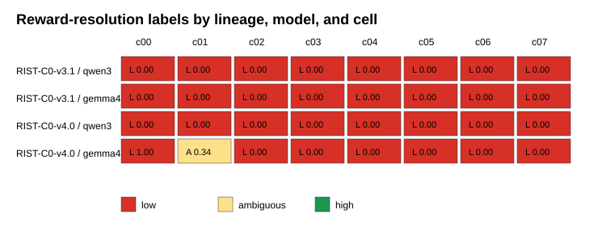
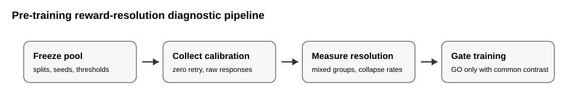

# When Tool-Use Supervision Becomes Unlearnable: Reward-Resolution Collapse under Group-Relative Objectives

Target venue: NeurIPS Evaluations & Datasets / evaluation methodology track.

Status: draft foundation, not submission-ready.

## Abstract

Multi-turn tool-use reinforcement learning often studies which intermediate
actions should receive supervision. We argue that this question has a prior
estimability condition under group-relative objectives: rollout groups must
contain terminal reward variation. Across two independently frozen RIST
task-pool lineages, 4,096 calibration trajectories passed infrastructure and
evidence-integrity checks but produced zero common high-resolution cells across
Qwen3-0.6B and Gemma4 E2B. The result demonstrates reward-resolution collapse:
all-fail, all-pass, and non-transportable mixedness can make action-span
supervision effects scientifically non-estimable even when task oracles,
deployment manifests, and validators are valid. We propose a pre-training
diagnostic checklist for group-relative tool-use RL and position reward
resolution as an evaluation-validity layer that should be reported before
supervision-topology or credit-assignment claims.

## 1. Introduction

Tool-use agents are increasingly trained with outcome-level rewards over
multi-turn trajectories. A common research question is whether every action
span, only final actions, full tool arguments, or tool names alone should receive
supervision. This question is meaningful only if the training objective can
observe reward contrast. Under group-relative objectives, if all rollouts in a
group receive the same strict reward, the effective advantage is zero or tied
for every rollout.

This paper studies that precondition. We report two terminal RIST lineages:
v3.1, which exposed all-fail collapse under long non-semantic codes, and v4.0,
which replaced that artifact with short semantic codes but still failed to
produce common high-resolution cells across two model families. The central
lesson is that valid task generation and valid serving infrastructure are not
sufficient for valid supervision-topology experiments.

Contributions:

1. A formal reward-resolution diagnostic for group-relative tool-use RL.
2. Two terminal case studies with 4,096 calibration trajectories.
3. A collapse taxonomy: all-fail, all-pass, and non-transportable mixedness.
4. A reproducible artifact package that generates the core evidence tables and
   figures.

## 2. Related work

Recent work such as TRACE, PORTool, TSPO, tree-structured credit assignment, and
teacher/token reward shaping addresses how to distribute learning signal across
turns or tokens. Our work asks a prior question: whether the sampled rollout
groups contain a learning signal to distribute. This distinction is summarized
in `RELATED_WORK_THREAT_MATRIX.md`.

## 3. Formalism

For a task \(x\), sample \(K\) rollouts with rewards \(r_i \in \{0,1\}\). A group
is reward-mixed if \(0 < \sum_i r_i < K\). If all rewards are identical, centered
group-relative advantages satisfy \(r_i - \bar r = 0\) for every rollout, and
rank/z-score variants also contain no contrast. Therefore topology-specific
gradients cannot be interpreted as evidence about strict task success.

Cell-level resolution counts how many task groups in a structural cell are
mixed. RIST v4.0 froze high as at least two mixed groups out of four, low as zero
mixed groups, and ambiguous as one mixed group.

## 4. RIST evidence

| Lineage | Trajectories | Common low cells | Common high cells | Decision |
| --- | ---: | ---: | ---: | --- |
| RIST-C0-v3.1 | 2,048 | 8 | 0 | KILL |
| RIST-C0-v4.0 | 2,048 | 7 | 0 | KILL |

RIST v3.1 produced all-fail collapse across both model families. RIST v4.0
showed that removing long hash-like codes was insufficient: Gemma4 solved c00
perfectly, but all-pass groups are still low-resolution for group-relative
learning; Qwen3 remained all-fail across all cells; and Gemma4 c01 was only a
single-family ambiguous cell.

## 5. Diagnostic pipeline

The proposed diagnostic pipeline freezes task pools, collects calibration
rollouts with zero retry, measures reward resolution, and only opens training if
common reward contrast is present. If the gate fails, the correct result is a
terminal instrument-validity finding, not a topology-training run.

## 6. Limitations

Current evidence is synthetic and uses two model families. The result does not
claim that action-span supervision never matters. It claims that topology
effects are not estimable under observed reward-homogeneous grouped rollouts.
The high-venue route requires an external public audit before submission.

## 7. Next required evidence

The frozen external audit protocol targets BFCL V3 Base Multi-Turn public tasks.
It will test whether reward-resolution collapse appears in a public function
calling benchmark or whether the diagnostic cleanly separates RIST-specific
failure from usable external task pools.
