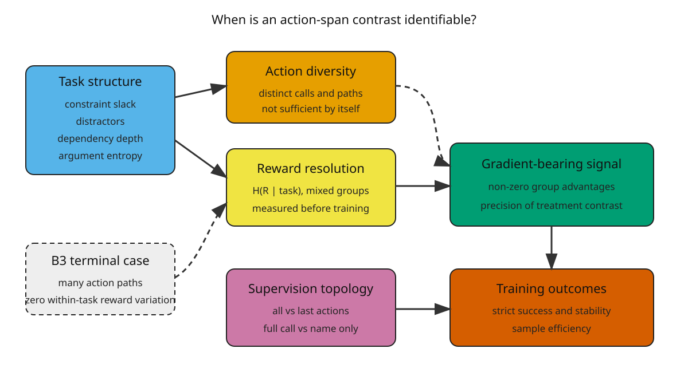

# P0 Scoping and Direct-Substitute Review

Protocol: `RIST-P0-v1.0`

Search date: `2026-08-01`

Decision: `PASS_NOVELTY_CONDITIONAL`

## Executive conclusion

No inspected work jointly treats reward/task resolution as a designed factor
and estimates its interaction with all-versus-last action supervision or
full-call-versus-name-only supervision in multi-turn tool-agent training.
Therefore the frozen direct-substitute gate does not fire.

The surviving gap is narrow. Reward-collapse diagnosis and repair, structural
task selection, turn-level credit, process-versus-outcome reward comparisons,
and name/argument decomposition are all occupied. A paper that merely reports
advantage collapse or proposes calibrated tasks would be substitutable by
current work. `RIST-v1` remains defensible only as a prospective causal
interaction benchmark with the four supervision cells and strict held-out
discipline.

## Search and screening

The frozen script executed five query families against four APIs:

| Source | Returned records | Failed queries |
| --- | ---: | ---: |
| arXiv | 7 | 0 |
| OpenAlex | 250 | 0 |
| Crossref | 250 | 0 |
| Semantic Scholar | 15 | 4 |
| **Total** | **522** | **4** |

Semantic Scholar's four failures are retained as unavailable-source evidence,
not interpreted as zero results. Title normalization reduced 522 records to
458 unique titles. The deterministic ranker retained 150 high-relevance
candidates for detailed title/abstract screening. Exact-title web search,
official arXiv/ACL pages, and citation chaining supplemented the API set.

The automated relevance score was used for ordering only. It was not an
inclusion classifier. The review is a targeted scoping review, not a dual-
reviewer systematic review.

## Direct threats and boundaries

| Work | What it occupies | Why it is not the frozen direct substitute |
| --- | --- | --- |
| [RC-GRPO](https://arxiv.org/abs/2602.03025) | Low within-group reward variation in multi-turn tool calling and an intervention that restores diversity. | It changes exploration with reward tokens; it does not cross reward resolution with the four action-span masks. |
| [Advantage Collapse in GRPO / AVSPO](https://arxiv.org/abs/2605.21125) | A collapse-rate diagnostic and virtual-sample repair across model scales. | It studies reasoning tasks and algorithmic repair, not tool-action supervision topology. |
| [TopoCurate](https://arxiv.org/abs/2603.01714) | RL task selection using error-branch ratio and strategic heterogeneity to improve gradient signal in BFCL/Tau2. | This is the closest task-selection threat, but it does not estimate all/last or full/name interactions. |
| [Iterative Reward Calibration](https://arxiv.org/abs/2604.02869) | Empirical discriminativeness of per-turn rewards and advantage-direction misalignment on Tau-Bench. | It calibrates dense reward tiers rather than action-token eligibility masks. |
| [Retrieval, Reward, and Training Protocols](https://arxiv.org/abs/2605.27881) | Controlled reward-design and training-protocol comparisons across search-agent models. | It compares credit methods but does not manipulate conditional reward resolution or call-content masks. |
| [TRACE](https://arxiv.org/abs/2607.13988) | Dense turn-boundary credit derived from reference-model state values. | It is a method contribution, not an identifiability factorial. |
| [A2TGPO](https://arxiv.org/abs/2605.06200) | Turn-group normalization and adaptive turn-level clipping. | It changes advantage construction, not which action spans or call fields receive loss. |
| [AT2PO](https://arxiv.org/abs/2601.04767) | Tree exploration, turn-wise credit, and turn-based optimization. | It does not cross task reward resolution with static mask topology. |
| [Knowing When to Ask / CARL](https://arxiv.org/abs/2605.27788) | Segment-level tool-use credit from binary outcomes. | It learns a critic for segment credit rather than testing mask identifiability. |
| [ToolPRM](https://aclanthology.org/2026.acl-long.855/) | Separate scoring of function-name and argument-filling decisions. | It occupies the decomposition itself, but not the corresponding training-mask interaction. |
| [ToolPRMBench](https://aclanthology.org/2026.findings-acl.602/) | Step-level PRM evaluation for tool agents. | It evaluates reward models, not supervision topology under controlled reward resolution. |
| [Proxy State-Based Evaluation](https://aclanthology.org/2026.acl-industry.87/) | Scalable verifiable reward for multi-turn tool calling. | It improves outcome measurement without the planned mask factorial. |
| [TASTE](https://arxiv.org/abs/2605.28556) | Tool-sequence-driven task synthesis and difficulty evolution. | It occupies benchmark difficulty generation, but not training identifiability. |
| [Granite Function Calling](https://aclanthology.org/2024.emnlp-industry.85/) | Granular name detection and parameter-value training tasks. | It is supervised multi-task training, not the all/last x full/name causal design. |

## Thematic synthesis

### Reward resolution is already a first-class optimization problem

RC-GRPO directly identifies low within-group variation in multi-turn tool
calling. AVSPO formalizes an advantage-collapse rate, while TopoCurate selects
tasks with informative failure branches. Consequently, `RIST-v1` cannot claim
to discover homogeneous-group collapse or the value of medium-difficulty
tasks.

### Credit granularity is saturated with methods

TRACE, A2TGPO, AT2PO, CARL, ToolPRM, and related turn/process reward work cover
turn boundaries, segment credit, adaptive clipping, and name-versus-argument
quality. Static masking is an experimental treatment only, not a novel method.

### The open question is an interaction, not either marginal factor

Existing studies usually improve reward/advantage construction or compare
credit methods under a fixed task distribution. None of the inspected work
asks whether a supervision treatment becomes statistically unidentifiable when
conditional reward resolution collapses despite diverse action sequences.
That interaction is the only surviving primary claim.

## Critical evidence assessment

Strengths of the proposed route are a prospective factorial, strict task
success, explicit separation of action and reward diversity, paired seeds, and
held-out gates. Major risks are severe adjacency to TopoCurate and reward-
calibration work, possible dependence on one synthetic task generator, and the
cost of enough independent training seeds. A single-model result would not
clear the main-conference bar.

The evidence base is fast-moving and dominated by 2026 preprints or newly
published conference papers. Independent replication is limited. Four
Semantic Scholar queries were rate-limited, and some candidates expose only
abstracts or announced future artifacts. These limitations weaken any broad
claim that the literature is exhausted; they do not create a blocked direct
substitute under the frozen rule because the closest candidates were readable.

## P0 gate

`PASS_NOVELTY_CONDITIONAL`

Allowed next step: P1 CPU task and measurement freeze.

Forbidden claims:

- that reward collapse is newly discovered;
- that task difficulty calibration is newly proposed;
- that turn-level or action-token credit is a new method;
- that function-name versus argument decomposition is new;
- that P0 alone upgrades the project to a main-conference route.

