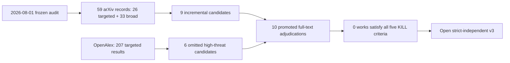

# Latest Full-Text Novelty-Threat Audit

Protocol: `RIST-R0-REFRESH-v2.0`

Search date: `2026-08-05`

Decision: `PASS_NOVELTY_OPEN_STRICT_V3`

## Answer first

No inspectable work found by this refresh satisfies all five frozen direct-
substitute criteria. A strictly independent v3 may therefore be established.

The novelty margin is narrower than it was on 2026-08-01. Turn-level credit,
action-token masking, complete-call supervision, tool-name/argument analysis,
group-normalized hindsight, and catastrophic-collapse stabilization are all
occupied. The surviving contribution is only the prospective interaction:

> Does pre-training conditional strict-reward resolution moderate the effect of
> crossing temporal eligibility (all versus last action turn) with structured
> call-content eligibility (full call versus tool name), under both update-count
> and cumulative-trainable-token matching?

This is an interaction and experimental-design claim, not a new optimizer or a
claim that structured-action masking itself is novel.

## Search flow

The two arXiv searches overlap and must not be interpreted as 59 unique papers.
Semantic Scholar returned HTTP 429; this is recorded as a retrieval limitation.
OpenAlex, arXiv, ACL Anthology/primary pages, and full-text source were otherwise
used. Raw-response hashes and promoted IDs are in `search_evidence.json`.

The prior causal visual remains applicable:
`../../../../figures/causal_identifiability_map.svg`.

## Strongest new threats

### TurnSight: strongest new turn-credit threat

TurnSight aggregates execution-conditioned teacher/student gaps at the turn
level, selects among multiple hindsight horizons, normalizes across sibling
rollouts, and uses the result to modulate GRPO advantages. Its natural decision
unit includes reasoning, tool selection, and arguments. It does not, however,
measure base-policy strict-reward resolution before treatment, vary all versus
last action turns, isolate tool names from full calls, or estimate the proposed
moderation. Source: https://arxiv.org/html/2608.04007v1

### SERL-SQL: strongest new action-mask threat

SERL-SQL applies execution-hindsight reweighting only to executable SQL and
tool-action spans and ablates the selective action mask. This directly occupies
the proposition that localized structured-action gradients can matter. Its
comparison is action versus non-action reweighting in Text-to-SQL; there is no
AF/LF/AN/LN factorial and no pre-treatment reward-resolution moderator. Source:
https://arxiv.org/abs/2608.00485

### PACT: strongest complete-call supervision threat

PACT supervises selected reasoning prefixes and complete expert tool-call spans,
explicitly preserving tool selection and argument specification. It ablates
tool-call supervision and anneals its loss scale. This is a mandatory baseline
and framing threat, but it studies privileged-trace SFT/RL composition rather
than policy-gradient eligibility under conditional reward resolution. Source:
https://arxiv.org/html/2606.16215v1

### TACO: strongest responsible-segment routing threat

TACO assigns self-supervised contribution credit to individual calls and routes
outcome advantage only to outcome-responsible segments. That is close to
structured action credit, but the routing is endogenous to the call outcome;
reward resolution is not an independently measured moderator and the four
fixed eligibility cells are absent. Source:
https://arxiv.org/html/2606.30251v1

### Structural-collapse study: strongest stability threat

Why Multi-Step Tool-Use Reinforcement Learning Collapses and How Supervisory
Signals Fix It compares several supervisory regimes across two model families,
traces collapse to control-token probability spikes, and reports stability and
OOD behavior. It varies supervision source and scheduling, not action-span
eligibility, and does not estimate resolution-by-supervision moderation. Source:
https://arxiv.org/html/2606.26027v1

## Threat adjudication

| Work | C1 tool-agent | C2 resolution moderator | C3 eligibility varied | C4 interaction | C5 outcomes | Verdict |
|---|---:|---:|---:|---:|---:|---|
| TurnSight | yes | no | no | no | yes | adjacent |
| SERL-SQL | yes | no | yes | no | yes | high threat, not substitute |
| TACO | yes | no | yes | no | yes | high threat, not substitute |
| PACT | yes | no | yes | no | yes | high threat, not substitute |
| Supervisory Signals / Collapse | yes | no | no | no | yes | stability baseline |
| Structured CLI Action Credit | yes | no | no | no | yes | credit baseline |
| SGCD | yes | no | no | no | yes | distillation baseline |
| CacheRL | yes | no | no | no | yes | systems baseline |
| Parameter Probe Training | yes | no | no | no | yes | argument diagnostic |
| ToolLIFT | yes | no | no | no | yes | workflow/reward baseline |

No row has five yes values. The machine-readable adjudication, including exact
non-overlap statements, is in `reviewer_threat_matrix.json`.

## Reviewer threat conclusion

The likely reviewer objection is no longer “nobody has studied structured tool
credit.” That statement would be false. The defensible claim is:

> Existing methods adapt rewards, advantages, teachers, or masks to provide
> better local credit. RIST instead holds the group-relative objective fixed and
> prospectively estimates when a simple structured eligibility topology is
> gradient-resolvable as a function of independently measured base-policy reward
> variation.

PACT, TurnSight, SERL-SQL, TACO, the structural-collapse study, and the original
R0 high-threat family must be named baselines or threats. If v3 cannot preserve
the fixed-objective, pre-treatment-moderator, token-matched, seed-level causal
design, the main-conference novelty claim should be killed rather than broadened.

## Limitations

- The search closes at the retrieval time on 2026-08-05; later same-day or later
  papers can change the verdict.
- Semantic Scholar was rate-limited.
- SERL-SQL v2 was inspected from its arXiv source because the experimental HTML
  renderer failed.
- Abstract-only screening was used for low-threat incremental papers after they
  failed the joint mechanism screen; all promoted high-threat works had
  inspectable full text.
- The external schematic generator was unavailable because
  `OPENROUTER_API_KEY` was not configured; no unpublished prompt was sent. The
  report uses a local flow diagram and the existing causal map.

## Gate

- direct substitute: none found;
- blocked high-threat full text: none;
- outcome: `PASS_NOVELTY_OPEN_STRICT_V3`;
- authorization opened: CPU-only construction and verification of an independent
  v3;
- authorization not opened: GPU, model download, serving, inference, training,
  qualification, held-out, or BFCL task access.
