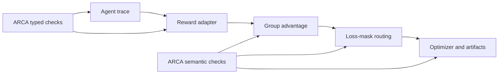

# ARCA CPU audit protocol

Protocol ID: `ARCA-CPU-AUDIT-v0.1`

Freeze date: `2026-08-01`

Evidence class: pre-GPU scientific qualification

## Research question

Can a CPU-only contract auditor identify silent agentic-RL failures that pass
ordinary runtime checks but corrupt rewards, advantages, treatment identity,
or loss masks, and does that result transfer to a held-out framework?

## Competing hypotheses

- H1 typed-contract: serialization and type mismatches silently corrupt reward
  computation while exit status and optimizer metrics remain valid.
- H2 semantic-contract: schema-valid traces can violate action/result,
  reward-informativeness, or outcome-consistency invariants.
- H3 identifiability: named experimental arms can be token-identical, and
  within-group normalization can be mathematically degenerate.
- H4 isolated-bug alternative: the observed AReno issue is a one-off bug with
  no cross-system scientific significance.
- H5 mutation-artifact alternative: a checker can score well only on synthetic
  faults that do not occur naturally.

## Framework split

- Discovery: AReno at source commit
  `c96bcf2da464dff36593d43c8d29991d4b998059` plus the issue #199 mask case.
- Development: one pinned public multi-turn framework selected during P0.
- Held-out: a second pinned public multi-turn framework selected during P0;
  its fixtures and source-level outcomes remain unopened until the auditor is
  frozen.
- Optional replication: a fourth framework only if P3 passes.

## Failure families

| ID | Contract | Required positive control |
|---|---|---|
| F1 | serialization/type normalization | equivalent JSON object and string yield the same canonical action |
| F2 | action/result trace integrity | exactly one matched result per accepted action |
| F3 | reward informativeness | reachable positive and negative fixtures produce non-constant reward |
| F4 | advantage identifiability | grouped rewards can produce a nonzero within-group advantage |
| F5 | treatment identity | preregistered arms select distinguishable token sets or declare aliasing |
| F6 | artifact provenance | manifest, event stream, and summary agree on source and execution state |

## Dataset and split

The registered target is at least three frameworks and four CPU workloads per
framework. Each clean workload has ten deterministic fixture seeds. Fault
mutants are generated by registered single-fault operators; combined faults
are excluded from the primary analysis.

The statistical unit is `framework × workload × failure_family`. Mutation
seeds are repeated measurements, not independent framework replications.

Discovery cases and development fixtures may guide implementation. Held-out
framework results may be evaluated once at the merge gate and may not be used
to tune rules or thresholds.

## Baselines

1. exit-code only;
2. finite-number check;
3. structural/schema validation;
4. repository-native unit tests where runnable;
5. full ARCA typed and semantic audit.

## Primary estimands

- macro recall across applicable framework/workload/failure-family cells;
- false-positive rate on clean fixtures;
- high-severity natural-case recall;
- conclusion-flip detection: a fault changes a registered arm comparison or
  GO/KILL decision while ordinary checks pass;
- preflight wall time and GPU commands prevented.

Report Wilson 95% intervals for proportions and a hierarchical bootstrap over
framework then workload cells for macro summaries. Do not treat mutation seeds
as independent systems.

## Mechanical gates

P0 returns `PASS_P0_NO_DIRECT_SUBSTITUTE_TO_P1` only if no inspected work or
tool jointly supplies cross-framework agentic reward/trace/advantage/mask
contracts, registered fault fixtures, and held-out transfer evaluation.

P1 returns `PASS_P1_PRODUCTION_REPRODUCTION_TO_P2` only if the production
AReno trace path reproduces at least one silent reward mismatch, a canonical
positive control restores the oracle value, issue #199 arm identity is checked,
and all fixtures are CPU-testable.

P2 returns `PASS_P2_CROSS_SYSTEM_TO_P3` only if at least three distinct natural
high- or medium-severity failure classes are reproduced across at least two
independent systems. Purely injected faults do not satisfy this prevalence
gate.

P3 returns `PASS_P3_CPU_AUDITOR_TO_GPU_AUTHORIZATION_REQUEST` only if:

- every registered high-severity natural case is detected;
- held-out macro recall is at least 0.90;
- clean held-out false-positive rate is at most 0.05;
- at least two natural cases flip a registered scientific conclusion or gate;
- each CPU workload completes within 60 seconds;
- all outputs are deterministic, finite, schema-valid CSV/JSON.

Otherwise return the narrowest `KILL_*`, `BLOCKED_*`, or `INVALID_*` outcome
and leave P4 unopened.

## Claim boundary

A CPU pass supports only that the auditor detected the registered contract
failures in the pinned systems and transferred under the recorded held-out
split. It does not establish field-wide prevalence, prevent reward hacking in
general, improve model capability, or validate CARe.

## Schematic

The optional AI schematic generator was unavailable because no OpenRouter key
was present. This version-controlled Mermaid figure is the non-external
fallback and does not alter the protocol.
