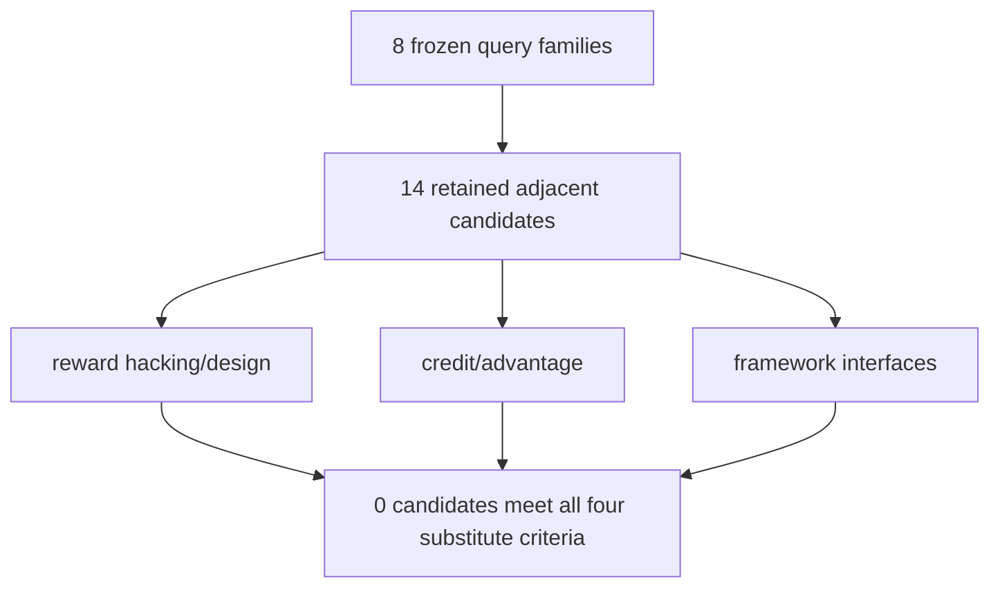

# P0 direct-substitute review

## Answer first

The frozen search did not identify a direct substitute for ARCA. The nearest
work establishes that reward exploitation, reward discriminativeness, group
advantage construction, and multi-turn credit assignment matter, but it treats
the computed reward and trajectory as scientifically valid inputs. ARCA asks an
earlier systems question: did the serialized trace, reward adapter, grouping,
and token mask preserve the intended experiment at all?

This is a conditional novelty result, not evidence that ARCA works or that the
failure is prevalent. Those claims remain gated by P1–P3.

## Evidence map

### Reward exploitation and specification gaming

RHB and SpecBench study agents exploiting an evaluator or visible tests. They
motivate adversarial reward evaluation, but their unit of failure is agent
behavior. ARCA's unit is a training-pipeline contract that can silently map an
honest trajectory to the wrong reward or treatment.

### Reward design and calibration

CM2, Iterative Reward Calibration, and automated reward-design work improve the
content or discriminativeness of rewards. They do not test whether tool-call
arguments retain equivalent meaning through serialization, nor whether named
mask arms select different tokens.

### Credit assignment and training stability

The credit-assignment survey, reasoning-collapse diagnostics, and the
practitioner's guide cover reward density, per-turn credit, grouped variance,
and optimization behavior. They are strong conceptual neighbors for ARCA's
advantage-informativeness check, but do not provide the full executable
cross-framework contract stack.

### Framework interfaces

veRL explicitly documents normalization of function-tool outputs and its reward
loop. OpenRLHF exposes token-in/token-out multi-turn agents returning rewards,
scores, feedback, done, and logs. AReaL documents multi-turn agentic support.
These are the systems to audit, not independent auditors; their different
interfaces also make a cross-framework checker nontrivial.

## Claimed gap

The defensible gap is narrow:

> A frozen, CPU-only, cross-framework preflight that checks typed trace/reward
> equivalence, action/result integrity, reward and group-advantage
> informativeness, token-mask treatment identity, and artifact provenance,
> evaluated on natural cases plus registered mutations with a held-out system.

ARCA must not be presented as a general reward-hacking defense, a better credit
assignment algorithm, or proof that the audited frameworks are unreliable.

## Threats to the novelty conclusion

- Search indexes and framework documentation change after the freeze date.
- Several 2026 papers are recent preprints; terminology may not use `contract`.
- Title/abstract screening can miss a checker described only in appendices or
  code. P2 must re-run exact component searches while inspecting pinned source.
- A direct substitute discovered later mechanically invalidates the novelty
  claim even if ARCA implementation has already begun.

## Screening flow

