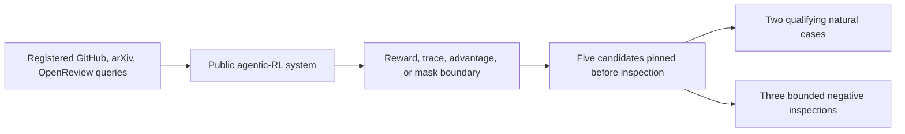

# P5 literature and system context

Search date: `2026-08-01`

This is a focused external-validation landscape check, not a claim of an
exhaustive systematic review. The registered queries in `search_log.md` were
run across three complementary primary-source channels: official GitHub
repositories, arXiv, and OpenReview. Search results were used only to locate
official sources; source-code findings were made at the commits in
`upstream_manifest.json`.

## Included system anchors

| System | Primary system source | Why it is in scope |
|---|---|---|
| slime | [official repository](https://github.com/THUDM/slime) and [multi-turn adaptation guide](https://github.com/THUDM/slime/blob/main/docs/en/get_started/quick_start.md) | exposes custom generation, reward, and loss-mask boundaries for agentic rollouts |
| Agent-R1 | [paper](https://arxiv.org/abs/2511.14460) and [official repository](https://github.com/AgentR1/Agent-R1) | defines a multi-step agent RL framework with environment and reward-loop interfaces |
| RAGEN | [paper](https://arxiv.org/abs/2504.20073) and [official repository](https://github.com/mll-lab-nu/RAGEN) | studies multi-turn agent RL, reward variance, trajectory filtering, and environment feedback |
| rLLM | [official repository](https://github.com/rllm-org/rllm) | provides agent workflows, evaluators, and RL training backends; no matching primary paper was found by the registered title query |
| Agent Lightning | [paper](https://arxiv.org/abs/2508.03680) and [official repository](https://github.com/microsoft/agent-lightning) | decouples agent execution and training through trajectory and credit-assignment interfaces |

All five systems satisfied the frozen inclusion criteria before their relevant
source files were opened. None was removed after a negative inspection.

## Adjacent evidence

- [Understanding Reasoning Collapse in Multi-Turn Agent Reinforcement
  Learning](https://openreview.net/forum?id=9ElTlEDWpx) studies reward-variance
  cliffs and diagnostics for reasoning collapse. It motivates auditing reward
  signal quality but does not provide cross-framework executable reward
  contracts or natural software cases.
- [A Practitioner's Guide to Multi-turn Agentic Reinforcement
  Learning](https://openreview.net/forum?id=K6T0o875zF) analyzes environment,
  reward sparsity, policy, and algorithm choices. Its focus is training design,
  not silent producer-consumer or provenance failures.
- [Agent^2 RL-Bench](https://arxiv.org/abs/2604.10547) evaluates agents that
  engineer RL pipelines and uses structured run instrumentation. It is close in
  operational motivation, but its target is agent engineering performance
  rather than frozen cross-system reward-contract auditing.

The narrower remaining gap is therefore not “reward quality has never been
studied.” It is that a successful agentic-RL run can silently erase or default
scientific signals at software boundaries, while existing method and framework
papers typically evaluate downstream training behavior rather than source-pinned
contract failures with positive controls and fail-closed artifacts.

## Selection flow

The optional AI schematic generator was unavailable because no OpenRouter key
was present. The version-controlled Mermaid diagram is the non-external
fallback; no unpublished project content was sent to an external model.
