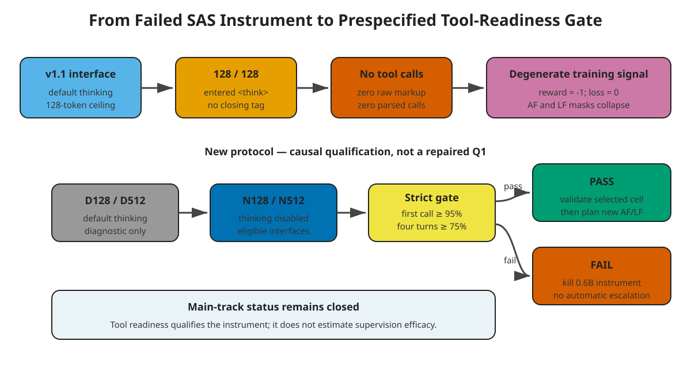

# Scoping Review: Action-Span Credit and Tool-Readiness Confounds

Search date: `2026-07-30`

Review type: targeted scoping and direct-substitute review

Decision: `KILL_STATIC_MASK_METHOD_NOVELTY`; `PASS_TOOL_READINESS_BRIDGE_ONLY`

## Scope

The review asked:

1. Is all-turn versus selected-turn/action-token credit already occupied?
2. Is function-name versus argument-level supervision already occupied?
3. Does current work treat base tool executability and reasoning budget as
   prerequisites for agentic RL?
4. Can the v1.1 failure support a main-conference pivot?

Included works had to be primary papers, official model documentation, or
official benchmark pages concerning language-agent credit, structured
function calls, multi-turn tool use, or Qwen3 tool-call generation. Surveys
were used only to map the field. Blog posts and unsupported secondary
summaries were excluded.

## Reproducible search

### arXiv API

- endpoint: `https://export.arxiv.org/api/query`;
- query:
  `(all:"multi-turn" AND all:"tool use" AND all:"credit assignment") OR
  (all:"action token" AND all:"reinforcement learning")`;
- sort: submitted date descending;
- result count: 33;
- retrieved: 33.

### OpenAlex

Query A:

- search: `"multi-turn tool use" credit assignment reinforcement learning`;
- date floor: 2024-01-01;
- sort: citation count descending;
- total: 59;
- retrieved: first 25.

Query B:

- search: `"action token" agentic reinforcement learning`;
- date floor: 2024-01-01;
- sort: publication date descending;
- total: 778;
- retrieved: first 25.

The second query was intentionally broad and noisy; title screening excluded
robotics/action-model papers outside language-agent credit assignment.

### Semantic Scholar

The relevance search was attempted twice without an API key and returned HTTP
429 both times. It is recorded as unavailable, not as zero results.

### Supplementary primary-source search

Official arXiv pages, ACL Anthology pages, and QwenLM's official Qwen3
function-calling and deployment documentation were searched. Across the API
returns, 83 records were inspected before cross-source duplication; the table
below contains the directly decision-relevant subset.

## Evidence synthesis

| Work | Evidence relevant to this project | Constraint |
| --- | --- | --- |
| [POAD](https://arxiv.org/abs/2405.15821) | Derives intra- and inter-action token credit assignment for language-agent PPO. | Fine-grained intra-action credit is not an open generic gap. |
| [ActFocus](https://arxiv.org/abs/2605.14558) | Downweights reasoning tokens and redistributes signal over action tokens. | Action-focused token weighting is directly occupied. |
| [TRACE](https://arxiv.org/abs/2607.13988) | Assigns dense rewards at tool-call boundaries using reference-model state values. | Turn-level credit is directly occupied. |
| [TRIAGE](https://arxiv.org/abs/2606.32017) | Applies role-typed segment credit for progress, exploration, infrastructure, and regression. | Semantic segment selection is occupied. |
| [PACT](https://arxiv.org/abs/2606.16215) | Co-trains multi-turn tool agents with privileged expert traces and RL. | Dense trace supervision is a strong direct baseline family. |
| [ToolPRM](https://aclanthology.org/2026.acl-long.855/) | Scores function-name and argument-filling decisions separately. | Name/argument decomposition is occupied. |
| [R2IF](https://aclanthology.org/2026.acl-long.1715/) | Jointly rewards function-call correctness and reasoning effectiveness. | Reasoning/action alignment in function calling is occupied. |
| [Teaching Thinking Models to Reason with Tools](https://arxiv.org/abs/2605.06326) | Reports that tool-enabled evaluation can degrade reasoning and emphasizes learnable tool trajectories plus stable RL initialization. | Tool readiness before RL is established as a practical requirement. |
| [Live API-Bench](https://aclanthology.org/2026.eacl-long.143/) | Measures executable multi-step API sequences and reports low completion for many models. | Strict multi-step executability is an active benchmark axis. |
| [NESTFUL](https://aclanthology.org/2025.emnlp-main.1702/) | Evaluates nested executable API sequences. | Multi-step sequence validity is already benchmarked. |
| [CONFETTI](https://aclanthology.org/2025.acl-long.394/) | Evaluates conversational function calls turn by turn. | Turn-level function-call evaluation is not itself novel. |
| [Qwen3 function-calling guide](https://github.com/QwenLM/Qwen3/blob/main/docs/source/framework/function_call.md) | Documents default thinking, non-thinking control, Hermes-style calls, and a 512-token no-thinking example. | v1.1's default-thinking 128-token setup was not a neutral interface choice. |

## Critical assessment

### What the literature kills

- Static all-turn versus selected-turn masking as a primary novel method.
- Generic action-token emphasis.
- Generic turn- or segment-level credit assignment.
- Function-name versus argument decomposition as a first contribution.
- A single-model report that disabling thinking repairs tool calls.

### What remains scientifically useful

A controlled factorial can still be valuable as a reproducible diagnostic if
it separates:

- inference-interface eligibility from training efficacy;
- default thinking from response-token budget;
- raw tool emission from parser behavior;
- action-only spans from reasoning-plus-action spans; and
- strict protocol completion from final semantic reward.

This is a construct-validity contribution only if it generalizes beyond one
model and task. The immediate v2 bridge is qualification work, not a paper
result.

## Review limitations

- This was a bounded scoping review, not an exhaustive systematic review.
- OpenAlex's broad action-token query was noisy.
- Semantic Scholar was rate-limited after one permitted retry.
- Most 2026 works are recent preprints or newly published proceedings with
  limited independent replication.
- Citation counts are not meaningful quality signals for papers only weeks old.
- No third-party OpenRouter key was available for the mandated AI schematic
  generator. The included SVG is a deterministic, repository-local fallback;
  no unpublished evidence was sent to a third party.
